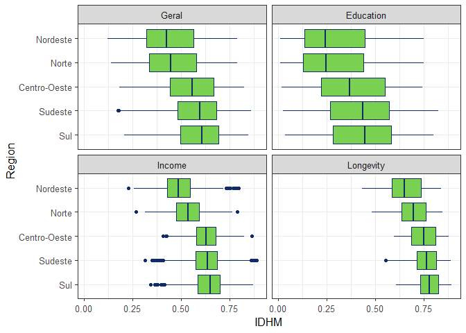

<!-- README.md is generated from README.Rmd. Please edit that file -->

# abjData <a href='http://abjur.github.io/abjData/'></a>

<!-- badges: start -->

[](https://github.com/abjur/abjData/actions)
<!-- badges: end -->

## Visão geral

Esse pacote contém conjunto de bases de dados utilizadas frequentemente
pela Associação Brasileira de Jurimetria.

Os dados incluídos são provenientes do Índice de Desenvolvimento Humano
dos municípios, coletados a partir do [Atlas do Desenvolvimento
Humano](http://www.atlasbrasil.org.br/) e [bases de dados
cartograficas](ftp://geoftp.ibge.gov.br/cartas_e_mapas/bases_cartograficas_continuas/bc250/versao2015/Shapefile/).

O objetivo do pacote é disponibilizar bases de dados para utilização
rápida em outros projetos.

## Para instalar

Para instalar a partir do endereço de um dos repositórios você precisa
ter o pacote `{remotes}` instalado.

``` r
# Para instalar pacote remotes
install.packages("remotes")
# Para instalar a versão GitHub (dev)
remotes::install_github("abjur/abjData")
```

## Bases disponíveis

| Base          | Descrição                                                                       |
|---------------|---------------------------------------------------------------------------------|
| `assuntos`    | Dados que contém informações sobre cifras ocultas.                              |
| `cadmun`      | (LEGADO) Um conjunto de dados que contém os códigos de cadastro municipal.      |
| `muni`        | Dados úteis de municípios para fazer join com outras bases.                     |
| `pnud_muni`   | Um conjunto de dados que contém informações sobre PNUD de municípios por anos.  |
| `pnud_min`    | Base minimal do PNUD municípios para fazer análises rápidas                     |
| `pnud_siglas` | Um conjuto de dados que serve como glossário das siglas disponíveis.            |
| `pnud_uf`     | Um conjunto de dados que contém informações sobre PNUD de Unidades Federativas. |

## Uso

Depois de instalado, basta carregar o pacote e chamar o conjunto de
dados que deseja usar.

O pacote `{abjData}` pode ser carregado como qualquer outro pacote de R:

``` r
library(abjData) # Carrega o pacote
library(tidyverse)
#> Warning: package 'tidyr' was built under R version 4.1.2
#> Warning: package 'readr' was built under R version 4.1.2
#> Warning: package 'dplyr' was built under R version 4.1.2
```

``` r
glimpse(pnud_siglas)
#> Rows: 237
#> Columns: 4
#> $ sigla      <chr> "uf", "ufn", "codmun6", "codmun7", "nomemun", "espvida", "f…
#> $ nome_curto <chr> "Código da Unidade da Federação", "Nome da Unidade da Feder…
#> $ nome_longo <chr> "Código da Unidade da Federação", "Nome da Unidade da Feder…
#> $ definicao  <chr> "Código utilizado pelo IBGE para identificação do estado.",…
```

### Exemplos de gráfico

IDH-Municipal:

``` r
pnud_min %>%
  pivot_longer(starts_with("idhm")) %>% 
  mutate(tipo = case_when(
    name == "idhm" ~ "Geral",
    name == "idhm_e" ~ "Educação",
    name == "idhm_l" ~ "Longevidade",
    name == "idhm_r" ~ "Renda"
  )) %>% 
  mutate(
    regiao_nm = fct_reorder(regiao_nm, value, median, .desc = TRUE),
    tipo = lvls_reorder(tipo, c(2, 1, 3, 4))
  ) %>% 
  ggplot() +
  geom_boxplot(
    aes(value, regiao_nm), 
    colour = "#102C68", 
    fill = "#7AD151"
  ) +
  facet_wrap(~tipo) +
  theme(legend.position = "none") +
  theme_bw(12) +
  labs(
    x = "IDHM", 
    y = "Região"
  )
```

<!-- -->

Posição dos municípios:

``` r
muni %>% 
  ggplot(aes(lon, lat)) +
  geom_point(size = .1, colour = viridis::viridis(2, begin = .2, end = .8)[1]) +
  coord_equal() +
  theme_void()
```

<!-- -->

## Requisitos

`{abjData}` requer uma versão do R superior ou igual a 3.4

## Licença

O `{abjData}` é licenciado sob os termos
[MIT](https://github.com/abjur/abjData/blob/master/LICENSE).
