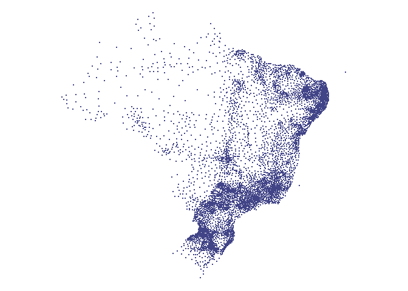

<!-- README.md is generated from README.Rmd. Please edit that file -->

# abjData <a href='http://abjur.github.io/abjutils/'></a>

<!-- badges: start -->

[](https://github.com/abjur/abjData/actions)
<!-- badges: end -->

## Visão Geral

Esse pacote contém conjunto de bases de dados utilizadas
corriqueiramente pela Associação Brasileira de Jurimetria.

Os dados incluidos são provenientes de fontes relacionadas ao Indíce de
Desenvolvimento Humano das Ufs coletados a partir do [Atlas do
Desenvolvimento Humano](http://www.atlasbrasil.org.br/), ao banco de
dados do “Sistema de Estatísticas do Poder Judiciário”, [Portaria
N° 216](https://www.cnj.jus.br/pesquisas-judiciarias/justica-em-numeros/base-de-dados/e%20as)
e [bases de dados
cartograficas](ftp://geoftp.ibge.gov.br/cartas_e_mapas/bases_cartograficas_continuas/bc250/versao2015/Shapefile/).

O pacote fornece elevado processamento de dados, o objetivo é agregar
dados de estrutura territorial do ranking do IDHM regional e nacional
nas pesquisas e relatórios.

## Para Instalar

Você pode instalar a versão mais recente do `{abjData}` com:

Para instalar a partir do endereço de um dos repositórios você precisa
ter o pacote `remotes` instalado.

``` r
# Para instalar pacote remotes
install.packages("remotes")
# Para instalar a versão GitHub (dev)
remotes::install_github("abjur/abjutils")
```

## Bases disponíveis

| Base          | Descrição                                                                       |
| ------------- | ------------------------------------------------------------------------------- |
| `cadmun`      | Um conjunto de dados que contém os códigos de cadastro municipal.               |
| `pnud_min`    | Um conjunto de dados que contém informações sobre PNUD de municípios            |
| `pnud_muni`   | Um conjunto de dados que contém informações sobre PNUD de municípios por anos.  |
| `pnud_siglas` | Um conjuto de dados que serve como glossário das siglas disponíveis.            |
| `pnud_uf`     | Um conjunto de dados que contém informações sobre PNUD de Unidades Federativas. |

## Uso

Depois de instalado, basta carregar o pacote e chamar o conjunto de
dados que deseja usar.

O pacote `{abjuData}` pode ser carregado como qualquer outro pacote de
R:

``` r
library(abjData) # Carrega o pacote
library(ggplot2)
library(dplyr)
library(magrittr)
```

``` r
glimpse(pnud_siglas)
#> Rows: 237
#> Columns: 4
#> $ sigla      <chr> "uf", "ufn", "codmun6", "codmun7", "nomemun", "espvida", "…
#> $ nome_curto <chr> "Código da Unidade da Federação", "Nome da Unidade da Fede…
#> $ nome_longo <chr> "Código da Unidade da Federação", "Nome da Unidade da Fede…
#> $ definicao  <chr> "Código utilizado pelo IBGE para identificação do estado."…
```

### Exemplo de Gráfico

``` r
pnud_min%>%
  filter(idhm > 0.700) %>%
  ggplot() +
  geom_boxplot(aes(regiao, idhm_e), colour = "#102C68") +
  theme(legend.position = "none") +
  theme_minimal() +
  labs(title = "IDHM educação por Regiões", y = "IDHM", x = "Regiões")
```



## Requisitos

`{abjuData}` requer uma versão do R superior ou igual a 3.6.

## Licença

O sistema de gerenciamento de conteúdo `{abjData}` é licenciado sob os
termos da [MIT + file
LICENSE](https://github.com/abjur/abjData/blob/master/LICENSE)
